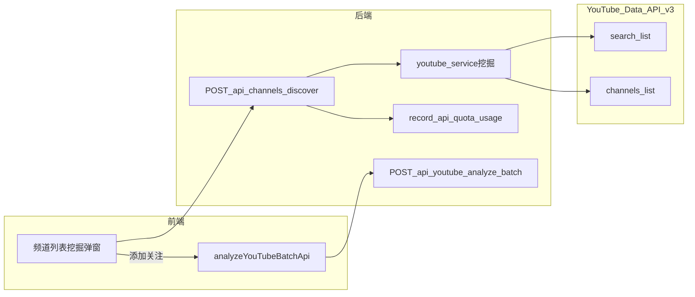

# AnalysisYoutube 项目说明 | Project README

---

## 中文

### 整体架构

- **前端**：React（Vite）+ Ant Design，负责频道管理、内容分析等交互界面。
- **后端**：FastAPI（Python），提供 `/api` 前缀的 REST 接口；业务模块按领域拆分（如 `youtube`、`channels`）。
- **数据库**：MySQL，存储用户、YouTube 频道与视频、配额用量等。
- **YouTube Data API v3**：由后端服务层统一封装 HTTP 调用（如 [`backend/app/services/youtube_service.py`](backend/app/services/youtube_service.py)），并在 [`backend/app/services/quota_service.py`](backend/app/services/quota_service.py) 中按接口类型累计配额（**search 单次约 100 点**）。
- **潜力频道挖掘（Discovery Radar）**：`POST /api/channels/discover` 采用「search.list → 去重 channelId → channels.list」两步策略，**仅返回 JSON，不落库**；用户在前端点击「添加关注」后，复用现有 `POST /api/youtube/analyze/batch` 异步任务写入数据库，**不修改 Channel 表结构**。

### 部署与数据库迁移

```shell
# 1. 启动 MySQL 与 backend（-d 后台；--build 重建镜像）
docker compose up -d mysql backend

# 2. 全量构建并启动
docker compose up --build -d

# 3. 在 backend 容器内执行 Alembic 迁移
docker compose exec backend alembic upgrade head
```

前端开发：在仓库 `frontend` 目录执行 `npm install` 与 `npm run dev`，并通过环境变量 `VITE_API_BASE_URL` 指向后端根地址（勿以 `/api` 结尾，见前端 `apiClient` 注释）。

### 关键功能

| 功能 | 说明 |
|------|------|
| 频道管理 / 批量录入 | 手动粘贴频道链接，提交 `analyze/batch` 后台导入 |
| 一键更新 | 同步已关注频道的 YouTube 数据并触发必要 AI 补全 |
| **潜力频道挖掘** | 按关键词 + 时间范围 + 粉丝上限筛选「近期高播放、小号」；结果仅展示，确认后再「添加关注」入库 |

### 业务流程图（挖掘 → 入库）



---

## English

### Architecture

- **Frontend**: React (Vite) + Ant Design for channel management and analysis UI.
- **Backend**: FastAPI under the `/api` prefix; domains split into routers (e.g. `youtube`, `channels`).
- **Database**: MySQL for users, YouTube channels/videos, and API quota accounting.
- **YouTube Data API v3**: Centralized in the Python service layer. Quota is tracked per endpoint family (**each `search.list` call costs about 100 units**).
- **Discovery Radar**: `POST /api/channels/discover` runs **search.list → dedupe channel IDs → channels.list**, returns JSON only (**no DB write**). “Follow” uses the existing **`POST /api/youtube/analyze/batch`** pipeline so the **Channel schema stays unchanged**.

### Deployment and migrations

```shell
docker compose up -d mysql backend
docker compose up --build -d
docker compose exec backend alembic upgrade head
```

For local frontend: `cd frontend && npm install && npm run dev`. Set `VITE_API_BASE_URL` to the backend origin **without** a trailing `/api`.

### Key features

| Feature | Description |
|---------|-------------|
| Channel list / bulk import | Paste channel URLs; `analyze/batch` runs in the background |
| Batch refresh | Syncs monitored channels and runs AI backfill where needed |
| **Discovery Radar** | Keyword + recency + subscriber cap to find “viral video, small channel” candidates; persist only after explicit follow |

### Flow (discovery → follow)

Same Mermaid diagram as in the Chinese section above.
